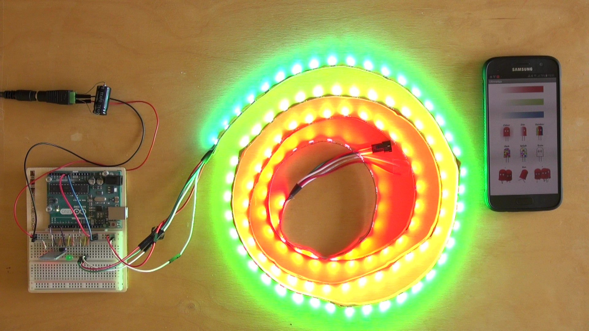
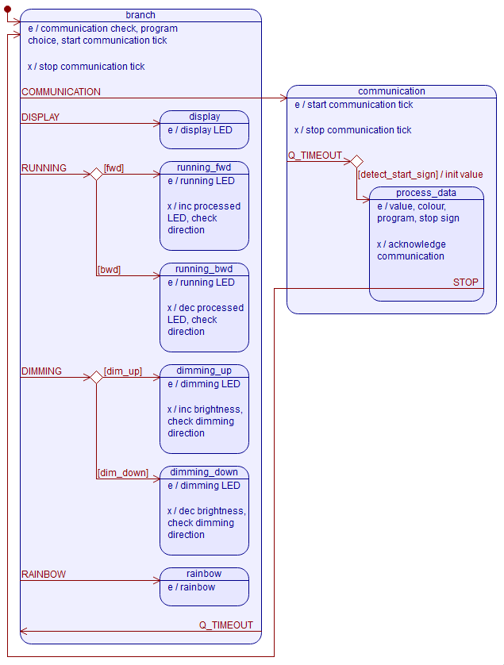
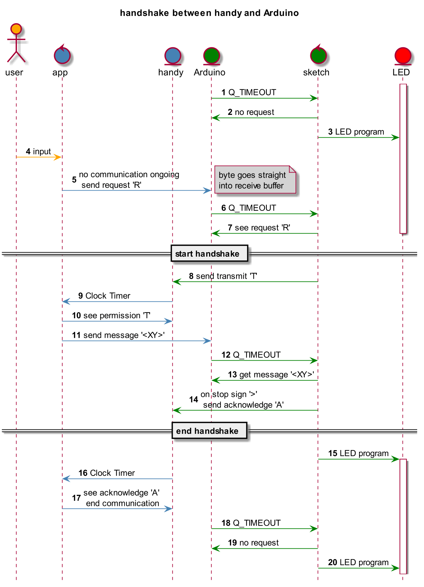

# LEDviaApp
  
Demo video: https://www.youtube.com/watch?v=NQhEtg-nRmY
### 1  Introduction
In the beginning a short introduction of myself.  
Professionally I work as an industrial electronics since many years. I put production machines into operation, optimize and repair them and do the troubleshooting. To do this one task is to look into the programmings of the controls. And from time to time I do some changes in the programs. Most of the PLC controls are from Siemens.  
With Arduino and the C language as a hobby I started in my free time about 3 years ago.  
I bought the Arduino starter Kit and tried a few things. As an advanced project I wanted to program a Zumo Robot form Pololu. But this turned out to be to much for me yet.  
It was a little bit overwhelming because compared to the PLC controls programming an embedded system in C is pretty less structured. You have the setup, the loop, many libraries, examples in the internet and than: Good luck!  
First I tried to find some German lessons and books in the Internet. Finally I landed with Kernighan & Ritchie - C Programming Language 2 and Steven Prata - C Primer Plus Sixth Edition. With these books I learned something about the C language but not very much about structuring a program for an embedded system.  
In the Internet I stumbled over terms like finite state machine and conceptions from Moore and Mealy. That was the addition to C that I was looking for. And right on the Arduino homepage I found the framework plus the modeling tool of Miro Samek http://playground.arduino.cc/Code/QP .
First of all I left the robot aside and started the project of controlling a LED stripe with a handy.  
Like I said I'm doing this for my hobby and so I can't put that much time in it. So it took me over 2 years to understand Miro's framework and model to end up this project. Puh!  
So please don't mind if I'm sometimes a little bit euphoric.
### 2  Control of a LED stripe
First I had to learn how to program the WS2812B 5050 RGB stripe with the WS2811 Controller.  
I found the libraries from Adafruit https://github.com/adafruit/Adafruit_NeoPixel and the alternative FastLED https://github.com/FastLED/FastLED , which is mentioned in the Internet to be faster. Both libraries come with very nice examples. But I ended up with the small library of Nick Gammon https://github.com/nickgammon/NeoPixels_SPI , because he shows the "bare metal" way to control the stripe. My intention was to get smaller code.
### 3  Starting with the Bluetooth module for the Arduino
The next step was to get the communication between my handy and the Arduino with the Bluetooth module HC-06 to run. For that purpose I found very helpful information from Martyn Currey http://www.martyncurrey.com/arduino-and-hc-06-zs-040/ and http://www.martyncurrey.com/arduinobtcontrol/ .
### 4  Programming of the handy app
The third challenge was to find something to program a handy app.  
Fortunately I didn't had to learn Java as I supposed because according to my information in the internet this is the most common language for that purpose. Presumably this would have cost me at least another year or more.  
So I was lucky to find the MIT App Inventor 2 http://appinventor.mit.edu/explore/get-started.html . Martyn Currey did already work on it in connection with the bluetooth module and the Arduino http://www.martyncurrey.com/arduinobtcontrol/ .  
More useful help in the Internet about the use of the App Inventor can be found from Abraham Getzler https://groups.google.com/forum/#!category-topic/mitappinventortest/2cd6Uz__xA0  and Taifun  https://puravidaapps.com/snippets.php#2enableBT .  
The App Inventor is completely graphical. I had to get used to it, because sometimes this is irritating. But it works for my simple app. It is also event driven like Miro Samek's framework. I had to go used to it, but now I like it.
### 5  First Arduino sketch and handy app attempt
With all these information together I was able to realize a first sketch and an app – and got into trouble or let's say had to enter the next level in embedded programming: Dealing with the hardware. I simply transmitted right away the color values that I generated with sliders in my app and soon the Arduino and the app got stuck.  
Through this thread of Robin2 http://forum.arduino.cc/index.php?topic=288234.0 and that from Nick Gammon http://www.gammon.com.au/serial I learned something about the function of the serial communication and that there are also interrupts involved. But the need of the interrupt for the serial communication and the strictly interdict of using interrupts while controlling the LED stripe doesn't go together. If the interrupts are off the communication can lose data and if the interrupts are on the control of the stripe gets corrupted because of the strict timing that is necessary. Furthermore I learned that the communication is asynchronous and I should use kind of a handshake and a frame around my data like a start and a stop sign for a tougher communication.  

### 6  Structured programming  
Even tough I tried to structure my sketch as general supposed like using small functions, using a switch/case structure and avoid blocking functions like delay() I was not very happy with the overview. I needed a few status variables and was jumping from function to function. And with every change I had to go almost through it all.  
This is the same experience I make in my job. As better a program is structured and if the structure is shown in a graphical manner the better it is to care for.  
For that reason I turned to the long way to learn to use the framework and the modeling tool from Miro Samek (link above). I liked it right away even tough my knowledge doesn't reach into its totally depth. The graphical modeling tool gives me a good overview coupled with the ability of  using code in the states, in the transitions or even in the underlying sketch. Furthermore I can use hierachical states what saves me repetition. And last but not least the framework does only react on signals and events depending on the current state, so I don't have to lock them in other states manually like in sequential programs.  
Some more information are within the documentation of the model.

### 7  Concluding remarks
So finally I realized my project with the following cornerstones.  
A) I let my data transfer only be 4 char long:  
1 char for the selected value together with 1 char of the selected colour or the selected LED program. Ahead of these 2 chars comes 1 char as a start sign. And afterwards comes 1 char as a stop sign.  
B) A handshake is implemented this way (see picture below):  
If a color or a LED program is changed in the app (4) and there isn't already a communication going on, it first sends only 1 char 'R' as a request to the Arduino and waits for the answer (5). This blocking is wanted because no new communication shall be started before an ongoing is processed by both the Arduino and the app.  
The char lands in the receive buffer of the UART. The sketch looks time triggered (6) into the receive buffer and when it sees the request (7), it sends a transmit char 'T' to the app (8) and stays in the communication state because like said before, communication and LED program can't work parallel.  
If the app sees the transmit char (10), also time triggered (9) by a Clock Timer, it sends the 4 char data '<XY>' (11) and wait again for the acknowledge of the Arduino. Because the sketch knows at this time that it awaits data it looks time triggered (12) for the start sign (13).
With the start sign '<' the sketch processes the data until the stop sign '>' shows up (14). Then it sends the acknowledge sign 'A' (14) and turns to the LED program (15).  
When the app receives the acknowledge sign it becomes ready for a next transmission (14).  
The sketch looks periodically time triggered (1, 16) into the receive buffer and turns back right away to the LED program if there is no new request (2, 17).  
C) I use the same time tick for the communication and the pause between the LED programs.

### 8  Technical specifications
Used hardware:  
Samsung Galaxy S5, HC-06 Bluetooth-Modul, Arduino UNO, 2m 120 LEDs WS2812B 5050 RGB Stripe with WS2811 Controller, AC adapter YU0510 5VDC 10A
### 9  Links
A) To realize my project I used:  
the online app Ide MIT App Inventor 2  
http://appinventor.mit.edu/explore/get-started.html

the Arduino IDE 1.8.x  
https://www.arduino.cc/en/Main/Software  

the QP-nano 5.8.2 for Arduino framework with its QM Graphical Modeling Tool 4.0.1  
http://playground.arduino.cc/Code/QP  

the LED library from Nick Gammon  
https://github.com/nickgammon/NeoPixels_SPI  

the Arduino SPI library from the installation path  
%Arduino installation path%\Arduino\hardware\arduino\avr\libraries\SPI\src  

To generate the sketch with the  QM Graphical Modeling Tool the library from Nick Gammon and the SPI library from Arduino has to be in the sketch path.  

B) Again for information because I'm very thankful to them:  
for sketch programming:  
Robin2  
	http://forum.arduino.cc/index.php?topic=288234.0

Nick Gammon  
	http://www.gammon.com.au/forum/?id=10894
	http://www.gammon.com.au/serial
	http://www.gammon.com.au/forum/?id=13357

Martyn Currey  
	http://www.martyncurrey.com/arduino-and-hc-06-zs-040/
	http://www.martyncurrey.com/arduinobtcontrol/

for QM programming:  
	https://state-machine.com/arduino/

for app programming:  
MIT App Inventor 2 Forum  
	https://groups.google.com/forum/#!forum/mitappinventortest/categories

Taifun  
	https://puravidaapps.com/snippets.php#2enableBT

Abraham Getzler  
	https://groups.google.com/forum/#!category-topic/mitappinventortest/2cd6Uz__xA0
